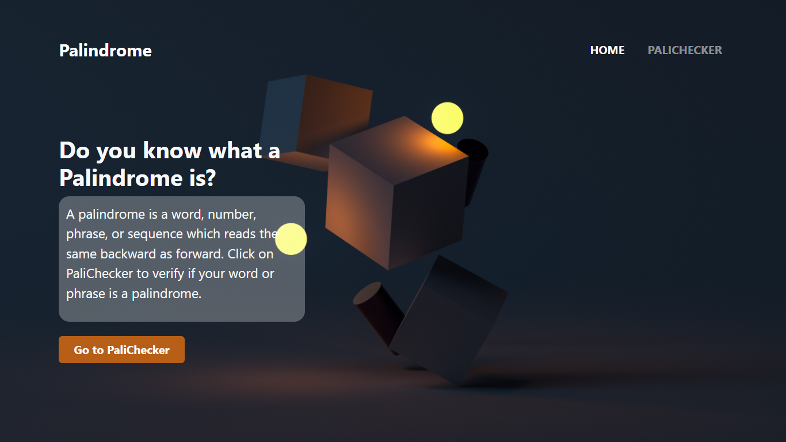
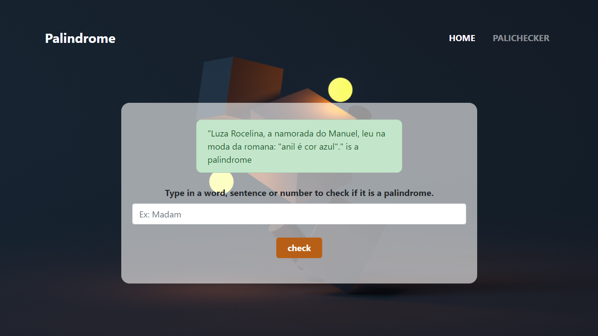

 

# Palindrome Checker

## Project 👩‍🔬 
  Check if a sentence is a palindrome.

  Allows the user to type words, sentences and numbers to check if they would be considered a palindrome or not. 
  
  It tolerates accentuated and punctuated sentences/words:

 

## Demonstration 🐱‍🏍

## Technologies 🐛

  * Node Js
  * Express
  * Ejs
  * Bootstrap
  

